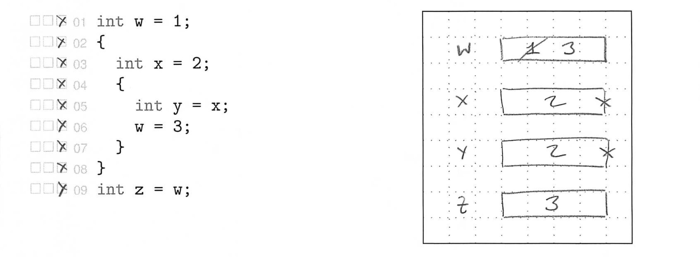

Topic 1: Introduction to C
==========================================================================

This topic will provide a gentle introduction to the basics of procedural
programming using the C programming language. C has a long history of use
in _computer systems programming_ which involves developing software to
connect the low-level computer hardware to high-level, user-facing
application software. Computer systems programming usually requires
careful consideration of performance and resource constraints. Examples
of computer systems software include compilers, operating systems,
databases, numerical libraries, and embedded controllers. C was developed
in the early 1970s at Bell Laboratories by Ken Thompson, Dennis Ritchie,
and many others. C was originally developed for the purposes of writing
an early version of the Unix operating system. The Linux operating system
which you will be using in the programming assignments was inspired by
these original versions of Unix, and the Linux kernel is also written in
C. C provides a nice balance between high-level abstractions for
productive software development and low-level control over the hardware,
and thus it remains one of the primary languages chosen by computer
systems programmers.

We will assume students have taken an introductory programming course in
a dynamic programming language (e.g., Python, MATLAB). This means we are
assuming students are familiar with basic programming constructs such as
variables, literals, operators, expressions, functions, conditional
statements, and iteration statements. Therefore this topic will focus
more on the specifics of C syntax and a precise way of illustrating
execution semantics which we will use throughout the rest of the course.
We will also start by focusing more on (precisely) _reading_ C programs
than on _writing_ C programs. Just as when learning a foreign language,
one must learn how to read before one can learn how to write!

1. Statements, Syntax, Semantics, State
--------------------------------------------------------------------------

At a fundamental level, any procedural program can be defined by the four
S's: statements, syntax, semantics, and state. The following diagram
illustrates the interaction between the four S's.

  

Let's start with an example based on the English language. A _program_ is
a sequence of statements. For example the following might be an English
language program:

 1. Put the letter in the envelope.
 2. Seal the envelope.
 3. Address the envelope.
 4. Put a stamp on the envelope.
 5. Put the envelope in the mailbox.

In this context, a _statement_ is just an English language sentence. For
example, "Put the letter in the envelope." is a statement. The _syntax_
is the proper English language grammar required for forming valid
sentences. For example, syntax tells us that the first word of a
statement should start with a capital letter, that a verb should have
proper tense, and a statement should end with an appropriate choice of
punctuation. The _semantics_ is the meaning of a sentence. For example,
semantics tells us that a letter is a "written, typed, or printed
communication, especially one sent in an envelope by mail or messenger",
and the semantics also help us understand that putting a letter in an
envelope makes sense. The statement "Put the elephant in the envelope."
would be syntactically correct but would not make much semantic sense.
Finally, the _state_ involves the memory of prior statements (i.e., the
state of the world) as we read or "execute" these statements. To execute
a statement, we use the syntax and semantics to understand how that
statement changes the state of the world. The "execution arrow" points to
the current statement we are reading or executing. So in this example,
the state captures the current status of the envelope. Is the envelope
sealed? Is it addressed? Does it have a stamp on it? Is it in the
mailbox? Here is a quick summary of the four S's:

 - **Program**: sequence of statements
 - **Statement**: sentence
 - **Syntax**: sentence grammar
 - **Semantics**: sentence meaning
 - **State**: memory of prior statements

When executing a program we often want to be more precise on exactly how
a program's syntax and semantics modify the state. We will use _state
diagrams_ as a way to capture a program's execution precisely. Although
drawing these diagrams may initially seem overly tedious, it is critical
that students master this skill early. By the end of the course we will
be drawing very complicated state diagrams to _precisely_ demonstrate our
understanding of the syntax and semantics of sophisticated programming
paradigms; but this is only possible if students work on mastering this
skill right from the beginning of the course.

The following is an example of a state diagram for executing a simple
English program with five statements.

  

Each statement includes a prefix with a line number and small set of
boxes, and there is space on the right to capture the state of the
program. To execute this program, we simply use the following steps:

 1. Identify which statement the execution arrow is pointing to
 2. Use the syntax and semantics to understand how this
     statement will change the state
 3. Update the state accordingly using the space on the right
 4. Cross off the box to the left of this statement
 5. Advance the execution arrow to point to the next statement

While we have explored statements, syntax, semantics, and state in the
context of an English language program, our understanding applies equally
well to computer languages. In the rest of this topic, we will learn the
basics about statements, syntax, semantics, and state in the C
programming language.

2. Variables, Literals, Operators, Expressions
--------------------------------------------------------------------------

We begin by exploring the statements, syntax, semantics, and state
associated with four fundamental C concepts: variables, literals,
operators, and expressions.

 - **Variable**: a box (in the computer's memory) which stores a value
 - **Literal**: value written exactly as it is meant to be interpreted
 - **Operator**: symbol with special semantics to "operate" on variables
     and literals
 - **Expression**: combination of variables, literals, and operators
     which evaluates to a new value

2.1. Variables
--------------------------------------------------------------------------

A variable is a box in the computer's memory which stores a value. It is
critical to keep the concept of a variable separate from the concept of a
value. A variable is _not_ a value. A variable _stores_ a value. The name
of a variable is called its _identifier_. In C, identifiers can include
lowercase letters, uppercase letters, numbers, and underscores. However,
identifiers cannot start with a number. Identifiers also cannot be
_keywords_ which are reserved words that have special meaning within the
C programming language. These rules are part of the C syntax for
identifiers. The following is a list of valid identifiers (i.e., correct
syntax):

    my_variable
    MY_VARIABLE
    myVariable
    MyVariable
    variable_0
    variable_1
    _variable
    __variable__

The following is a list of invalid identifiers (i.e., incorrect syntax):

    0_variable
    variable$1

The first identifier has invalid C syntax since it starts with a number,
and the second identifier has invalid C syntax since it includes the `$`
character. These are called _syntax errors_.

There are many styles of identifiers. For example, _snakecase_ favors
using lowercase with underscores to separate words (i.e., `my_variable`),
while _camelcase_ favors using lowercase with uppercase to separate words
(i.e., `myVariable`, `MyVariable`). Often we might favor using uppercase
with underscores to indicate constant variables (i.e., `MY_VARIABLE`),
and we might favor using leading and training underscores to indicate
special internal variables (i.e., `__variable__`). Note that the C
compiler does not care about which valid identifier a programmer uses to
name any given variable. So why not simply name each variable `a0`, `a1`,
`a2`, etc? While the C compiler does not care, the _reader_ of your
program _definitely_ cares about which valid identifiers a programmer
uses. Careful and consistent selection of identifiers can significantly
improve the readability of your programs, which in turn makes your
programs easier to debug, maintain, and extend. It is also important to
note that in practical situations the programmer actually does not get to
choose his or her own coding style (or coding conventions). A company or
open-source project will usually have its own coding conventions that it
expects its developers to follow. Similarly, in this course we have our
own coding conventions that we expect students to follow. The coding
conventions are located here:

  - <https://cornell-SFU-CMPT-431.github.io/ece2400-docs/ece2400-coding-conventions>

All variables also have a _type_. The type specifies the kind of values
that can be stored in a variable. In dynamically typed languages (e.g.,
Python, MATLAB) the "types" of variables are not be known until run time
(i.e., dynamically), while in statically typed languages (e.g., C, C++)
the "types" of variables must be known at compile time (i.e.,
statically). This is an absolutely critical distinction that also has
fundamental implications with respect to the tension between
productivity- vs. efficiency-level languages. We will learn more about C
types in Topic 3. For now, we will only use variables of type `int` which
can store signed integer values. Signed integers include zero, negative
whole numbers, and positive whole numbers.

We can now introduce our very first example of a C statement. A _variable
declaration statement_ is used to create a new variable with a specific
name and type. The following is a list of valid variable declaration
statements:

    :::c
    int my_variable;
    int MY_VARIABLE;
    int MyVariable;
    int myVariable;
    int variable_0;
    int variable_1;
    int _variable;
    int __variable__;

Each statement creates a new box to hold a value of type `int`. As an
aside, `int` is a keyword meaning that it cannot be used as an
identifier for a variable. Note that C syntax requires all C statements
to end in a semicolon. Forgetting to include the semicolon is a syntax
error (meaning the C compiler cannot understand the syntax).

??? question "Activity 1: Valid vs. Invalid Identifiers"

    Which of these identifiers are valid and which are invalid?

        foo_bar
        42_foo_bar
        42-foo-bar
        _42_foo_bar
        FOO_BAR
        @FOO_BAR
        __FOO_BAR__
        foobarbaz
        fooBar%Baz
        fooBar_BazFoo
        m_foo
        _
        __
        int

2.2. Literals
--------------------------------------------------------------------------

A literal is a value written exactly as it is meant to be interpreted.
Contrast a literal to a variable. A variable is a name for a box that can
hold many different values (all of the same type!). A constant variable
is a name for a box that can hold a single (constant) value. A literal is
not a name; it is not a variable. A literal is _literally_ the value
itself. Some example integer literals are shown below.

    42
    -42
    0x42
    0xdeadbeef

The integer literal on line 1 is literally the number 13 in base 10. The
integer literal on line 2 is literally the number -42 in base 10. The
integer literal on line 3 is literally the number 42 in base 16 (i.e., 66
in base 10). Finally, the integer literal on line 4 is literally a large
number in base 16. Notice that C syntax specifies that by default integer
literals are assumed to be base 10, but if the number includes a `0x`
prefix then the integer literal is in base 16 (hexadecimal).

??? question "Activity 2: Hexadecimal Literals"

    Calculate the decimal value of the following hexadecimal literals.

        0x13
        0x1000
        0xaa
        0xcafe

2.3. Operators
--------------------------------------------------------------------------

An operator is a symbol with special semantics to "operate" on variables
and literals. The very first operator we will study will be the
_assignment operator_ represented with the equal symbol (`=`). The
assignment operator "assigns" a new value to a variable (i.e., puts a
value into the variable's box).

This brings us to our second example of a C statement. An _assignment
statement_ combines the assignment operator with a left-hand side (LHS)
and a right-hand side (RHS). The LHS specifies the variable to change,
and the RHS specifies the new value (possibly using a literal). An
example of a program with two statements is shown below.

    :::c
    int my_variable;
    my_variable = 13;

The first line is a variable declaration statement, and the second line
is an assignment statement. The semantics are that the first statement
creates a box in the computer's memory, and the second statement stores
the value 13 in that box.

A variable declaration statement and an assignment statement can be
combined into a single _initialization statement_. An example of the same
program implemented with a single statement is shown below.

    :::c
    int my_variable = 13;

We have now learned about three kinds of C statements: variable
declaration statements, assignment statements, and initialization
statements. It is important to distinguish between these three kinds of
statements, especially since in C++ each of these three kinds of
statements can result in quite different semantics.

There are many other operators besides the assignment operator. For
example, there are arithmetic operators for addition (`+`), subtraction
(`-`), multiplication (`*`), division (`/`), and modulus (`%`).

All of these operators can operate on integer values. We will discuss in
Topic 3 subtle issues related to the fact that the computer can only
represent integer values up to a specific minimum and maximum value. Note
that the division operator (`/`) is for _integer_ division meaning that 6
/ 2 is 3 and 5 / 2 is 2 not 2.5. So the result of an integer division is
always rounded towards zero, or in other words the fractional part is
simply removed (truncated). Why does the C programming language round
towards zero? Why not round to the nearest whole number? Again the C
programming language is choosing efficiency; it is slightly more
efficient to simply remove the fractional part vs other rounding schemes.

??? question "Activity 3: Integer Division and Modulus"

    Calculate the result of applying the following integer division and
    modulus operators.

         15 / 2
         15 / 3
         15 / 4
         15 / 5
        -15 / 2
        -15 / 3
        -15 / 4
        -15 / 5
         15 % 2
         15 % 3
         15 % 4
         15 % 5

2.4. Expressions
--------------------------------------------------------------------------

An expression is a combination of variables, literals, and operators
which _evaluates_ to a new value. A variable's identifier is itself an
expression that evaluates to the value stored in that variable. An
example of an expression is shown below.

    5 - 3

This expression evaluates to the value 2. Another example expression is
shown below.

    8 / 2 * 2 + 2

This expression can evaluate to different values depending on the order
in which we apply the sequence of operators. Several options for how to
evaluate this expression are shown below.

    ((8 / 2) * 2) + 2 evaluates to 10
    (8 / 2) * (2 + 2) evaluates to 16
    8 / (2 * (2 + 2)) evaluates to  1
    (8 / (2 * 2)) + 2 evaluates to  4
    8 / ((2 * 2) + 2) evaluates to  1

Note that the final expression evaluates to 1.33 but since this is the
integer division we round towards zero resulting in a value of 1. The C
programming language includes semantics to unambiguously specify the
correct answer based on an operator precedence table. An initial version
of this table which just includes the operators we have already learned
about in this topic is shown below.

| Category       | Operator    | Associativity |
| -------------- | ----------- | ------------- |
| Multiplicative | `*` `/` `%` | left to right |
| Additive       | `+` `-`     | left to right |
| Assignment     | `=`         | right to left |

Early rows have higher precedence than lower rows. So the multiplicative
operators have the highest precedence and then the additive operators.
The associativity column indicates the order to apply the operators when
those operators are at the same precedence. So for the above example, we
first consider the multiplicative operators and then move from left to
right applying those operators. So we apply the division operator first,
then the multiplication operator, and finally the lower precedence
addition operator:

    ((8 / 2) * 2) + 2 = 10

Note that all operators are included in the precedence table, even the
assignment operator. Since the assignment operator is the last row it has
the lowest precedence. This means we evaluate the LHS and RHS of the
assignment operator first before doing the actual assignment. An example
is shown below.

    x = 5 - 3

We apply the subtraction operator first and so the RHS evaluates to the
value 2. Then we apply the assignment operator which sets the value of
variable `x` to be 2. Note that every expression evaluates to a value,
and since `x = 5 - 3` is an expression then it also evaluates to a value!
The C programming language specifies that the value of applying the
assignment operator is the value of the LHS. This enables complicated yet
syntactically correct expressions such as:

    y = x = 5 - 3

As before, the addition operator has the highest precedence. The
precedence table specifies that the corresponding associativity is right
to left. This is what the expression would look like if we inserted
according to the precedence table.

    y = (x = (5 - 3))

The expression `5 - 3` evaluates to 2, and the expression `x = 2`
evaluates to the value 2 (with a side-effect of updating the variable
`x`). In other words, this expression sets the value of both variable `x`
and `y` to 2.

One key take-away from this discussion is that while an expression might
be syntactically correct, it doesn't mean that it is readable. We should
always prefer explicitly using parenthesis to indicate the desired order
of operations.

??? question "Activity 4: Operator Precedence"

    Calculate the result of evaluating the following expressions.

        8 / 2 * 2 * 2
        8 / (2 * (2 * 2))
        8 / 2 + 2 * 2
        (8 / (2 + 2)) * 2
        x = 2
        x = 8 / 2

2.5. Simple C Program
--------------------------------------------------------------------------

We can now compose assignment and initialization statements which use
variables, literals, operators, and expressions to create our very first
simple C program. Let's translate the English "program" we saw in Section
1 into a C program.

  

To execute this program, we simply use the same steps we used before:

 1. Identify which statement the execution arrow is pointing to
 2. Use the syntax and semantics to understand how this
     statement will change the state
 3. Update the state accordingly using the space on the right
 4. Cross off the box to the left of this statement
 5. Advance the execution arrow to point to the next statement

This program uses a variable declaration statement to create a variable
named `x` (line 1), uses an assignment statement to set the value of
variable `x` to 5 (line 2), uses another variable declaration statement
to create a variable named `y` (line 3), uses another assignment
statement to set the value of variable `y` to 2 (line 4), uses another
variable declaration statement to create a variable named `z` (line 5),
and finally uses another assignment statement to set the value of
variable `z` to the value of the expression `x - y` (line 6).

Let's look at another simple C program that illustrates an issue with
uninitialized variables.

  

Lines 1 and 2 are variable declaration statements that create boxes in
our state diagram, but we do not assign a value to these boxes. These
variables are called _uninitialized_. An uninitialized variable is not
itself a problem. There is nothing syntactically or semantically wrong
with lines 1 and 2. However, _using_ an uninitialized variable does have
undefined semantics. What does it mean for something to have undefined
semantics? If something has undefined semantics it could: cause a compile
time error message, cause a runtime error message, cause your program to
crash, cause your program to hang forever, cause nothing wrong to happen,
delete your hard drive, or crash your entire computer. So we should avoid
doing anything which has undefined semantics. However, this begs the
question, why does the C programming language even include undefined
semantics? Why doesn't the C programming language specify that these
uninitialized variables are automatically initialized to zero? This would
certainly avoid undefined semantics and many common bugs. Recall that C
is a computer systems programming language optimized for efficiency.
Automatically initializing variables to zero would add a small but
non-trivial overhead which could quickly have an impact on the overall
performance of your programs. When faced with a choice between safety and
efficiency, the C programming language will almost always choose
efficiency. This is why it is an efficiency-level language! However, this
also means that C programmers must be very careful in how they write
their programs to avoid undefined behavior at all costs. This example
also illustrates that sometimes you will need to include additional
annotations to your state diagrams to explain the execution of a program.
There is nothing wrong with including such additional annotations; the
key is to make sure your state diagrams effectively capture your
understanding of the program's execution.

Let's look at one more simple C program that illustrates how values are
copied between variables, and how we can assign new values to variables.

  

Line 4 uses an assignment statement to _copy_ the value in variable `x`
into the variable `y`. It is critical to remember, that assignment
_copies_ the actual value. It does not copy any kind of high-level
reference as in some dynamic programming languages (e.g., Python). Line 5
uses an assignment statement to update the value in variable `x`. Note
that line 5 does _not_ create a new variable named `x` (it is an
assignment statement, not an initialization statement), and line 5 does
_not_ modify the value in variable `y` in any way (since variable `y`
made a copy of the value 5). Also notice that we should never erase
values in our state diagrams. Instead, you should simply cross out the
old value and enter the new value. This way we can easily see how the
state has changed over the execution of the program.

??? question "Activity 5: State Diagram for a Simple C Program"

    Draw a state diagram corresponding to the execution of this program.
    Remember to check off the execution boxes as you execute each
    statement. When executing line 4, recall the operator precedence
    table discussed in Section 2.3.

    

3. Blocks, Scope, Name Binding
--------------------------------------------------------------------------

Blocks, scope, and name binding provide syntax and semantics to help
manage more complex procedural programs.

### 3.1 Blocks

A _block_ is a compound statement, meaning it is a new kind of statement
which is made up of a sequence of other statements. Blocks are indicated
using curly braces. An open curly brace (`{`) is used to open a block,
and a close curly brace (`}`) is used to close a block. Blocks will be
critical for defining functions, conditional statements, and iteration
statements. Two examples of blocks are shown below.

    {
      int x = 2;
      int y = x;
    };

    {
      int z = 3;
      z = z + 1;
    };

Since a block is itself a statement, it has a trailing semicolon.
However, this semicolon is optional, and in practice it is usually
omitted.

    {
      int x = 2;
      int y = x;
    }

    {
      int z = 3;
      z = z + 1;
    }

### 3.2 Scope

The scope of a variable is the region of code where it is accessible.
Blocks create new _local_ scopes, and variables declared within a block
are only accessible from within that block. An example of a simple C
program which uses a block to create a local scope is shown below.

 

Notice that we have introduced some additional notation in our state
diagram. We use an X on the right of a variable's box to indicate that
this variable has gone out of scope and thus has been deallocated.

Let's look at another example of using a block to create a local scope.

 

There is an error on line 6. We cannot access the value of variable `y`
because variable `y` went out of scope (i.e., was deallocated) on line 5
when the block closed. This would cause a compile time error.

Blocks can be nested. Let's look at another example where we read and
write variables in an outer block.

 

The variables `x` and `w` are accessed within the inner block, even
though these variables were declared in outer blocks. The change to
variable `w` persists even after the inner block closes (i.e., changes
are not "undone" in any way).

Notice that as we open new local scopes we gradually allocate variables
from top to bottom in our state diagram, and then as we close local
scopes we gradually deallocate these variables from bottom to top in our
state diagram. The variables are allocated and deallocated as in a
_stack_. In a stack of cards, we place cards on top of each other, and
then we draw cards from the top. In a stack of cards the stack grows up
and then "shrinks" down. In the C stack, the stack grows down and then
"shrinks" up. We will start calling the space on the right of our state
diagrams the "stack".

??? question "Activity 6: State Diagram for Nested Scope"

    Draw a state diagram corresponding to the execution of this program.
    Remember to use an X to indicate when variables go out of scope and
    are thus deallocated.

    

### 3.3 Name Binding

So far, all of our code examples have only had one variable with any
given name. However, in large programs we will have to reuse the same
variable name in different places. _Name binding_ is the process of using
well-defined rules to determine which variable declaration a specific
variable name refers to. Note that in C, name binding happens at compile
time. This means that we should be able to determine which variable
declaration a specific variable name refers to based just on the code in
our state diagrams (i.e., we should not need to use the runtime
information in the stack).

C does not allow two variables to have the same name in the same block.
The following code is syntactically incorrect and will cause a compile
time error:

    int x = 3;
    int x = 3;

However, C does allow two variables to have the same name in different
blocks.

    {
      int x = 3;
      int y = x;
    }

    {
      int x = 5;
      int z = x;
    }

This makes sense, since the variable named `x` declared on line 2 has
been deallocated by the time we reach the variable initialization
statement on line 7. There is no ambiguity on which variable declaration
for `x` is being referenced on lines 3 and 8.

C also allows two variables to have the same name in nested scope.

 

In this case, there are two variables with the name `x` that are in scope
at the same time. The variable named `x` declared on line 3 is said to
_mask_ the variable named `x` declared on line 1. There are also two
places where `x` is being referenced: first on line 4, and then again on
line 6. The name binding rules specify which variable named `x` is being
referenced on lines 4 and 6. The name binding rule in C is follows:

 1. start from where the variable `x` is being read or written
 2. work backwards out of the blocks, through open curly braces
 3. the first declaration of variable `x` is the one to use

It is like peeling an onion. We peel off each block one at a time until
we find the first declaration of the variable `x`. In the above example,
if we start on line 4, then we would immediately find a variable named
`x` which was declared earlier in the same block. If we start on line 6,
then we don't even need to worry about the variable named `x` on line 3
since it has already gone out of scope.

Let's look at another example with three variables named `x`.

 

The access to `x` on line 6 corresponds to the variable declared on line
4, and the access to `x` on line 8 corresponds to the variable declared
on line 7.

Note that as with operator precedence, it is usually best if you develop
your programs to avoid subtle name binding issues. Ideally, it should be
obvious from reading your program which variable name refers to which
variable declaration without needing to carefully consider the name
binding rules.

??? question "Activity 7: State Diagram for Name Binding"

    Draw a state diagram corresponding to the execution of this program.
    Remember to use an X to indicate when variables go out of scope and
    are thus deallocated. Use the name binding rules to determine which
    variable named `x` is being referenced on line 6, and which variable
    named `y` is being referenced on lines 6 and 8.

    

4. Functions
--------------------------------------------------------------------------

A _function_ gives a name to a _parameterized_ sequence of statements. A
_function definition_ describes how a function behaves. A _function call_
is a new kind of expression to execute a function. Note that all code in
C programs are inside functions! Functions are sometimes called
_procedures_, and they are the key to procedural programming. In this
section, we will discuss the syntax of a function definition before
discussing the syntax and semantics of a function call. We will explore
several different examples of simple C programs that use functions, and
we will conclude by introducing the `printf` function which can be used
to print values to the screen.

### 4.1. Function Definition

A _function definition_ defines the sequence of statements that make up
the function. The syntax for a function definition is shown below.

    :::c
    rtype function_name( ptype0 pname0, ptype1 pname1, ... )
    {
      function_body;
    }

The _function name_ is a unique identifier for the function. Function
names must follow the same restrictions on identifiers as with variable
names. The _function body_ is the parameterized sequence of statements.
The _parameter list_ is a list of parameter types and names separated by
commas (e.g., `ptype0 pname0` on line 1). Finally, the _return type_ is
the type of the value returned by the function (e.g., `rtype` on line 1).
Note that we call just line 1 the _function prototype_. A function
prototype specifies the _interface_ for the function (i.e., name,
parameter types, and return type) without specifying the actual
implementation. An example function that returns the square of an integer
is shown below.

    int square( int x )
    {
      int y = x * x;
      return y;
    }

In this example, the function name is `square`, the function body
consists of two statements, the parameter list includes one parameter
named `x` of type `int`, and the return type is also `int`. Line 4 is a
new kind of C statement called a _return statement_. A return statement
first evaluates the given expression and then returns the corresponding
value as the result of calling the function. Let's look at another
example function.

    int main()
    {
      int a = 10;
      int b = a * a;
      return 0;
    }

This function does not take any parameters. The function named `main` is
special. It is always the first function executed in a program. The
`main` function returns its "value" to the "system", and this value is
called the _exit status_ of the program. On Linux, returning zero means
success, and returning an integer greater than zero means failure.

Note that in this `main` function we could refactor the expression on
line 4 into the `square` function. This might make it easier to reuse a
parameterized sequence of statements in many different places. Or it
might be more effective to just directly calculate the square as shown.
The art of determining how to refactor code into functions is a
fundamental part of procedural programming.

### 4.2. Function Call

A _function call_ is a new kind of expression with new syntax and
semantics that is used to execute the parameterized sequence of
statements in a function definition. The syntax for a function call is
shown below.

    :::c
    function_name( pvalue0, pvalue1, ... )

So to call a function we simply use its name and pass in one value for
each parameter in the parameter list surrounded by parenthesis. If the
parameters are themselves expressions, then we must evaluate these
expressions _first_ before calling the function. A function call is
itself an expression which evaluates to the value returned by the
function. Function parameters and "local" variables declared within a
function body are effectively in a new block which is called the
function's stack frame. Note that the value of each parameter is _copied_
into these local variables. This is known as _call-by-value_ semantics.
We will learn about _call-by-pointer_ and _call-by-reference_ in later
topics.

The _caller_ is the code which is calling the function, and the _callee_
is the function which is being called. The precise semantics for calling
a function are shown below.

 1. Evaluate parameters, allocate temporary
     storage in caller's stack frame if necessary
 2. Allocate storage on caller's stack frame for the return value if necessary
 3. Allocate the callee's stack frame with space allocated for parameters
 4. Copy evaluated parameters from step 1 into callee's stack frame
 5. Record location of function call
 6. Move execution arrow to first statement in callee
 7. Evaluate statements inside the callee
 8. At return statement, evaluate its argument, update appropriate variable in caller
 9. Return execution arrow back to where function was called in caller
 10. Deallocate the callee's stack frame

We will use several examples to illustrate these ten steps. Our first
example illustrates a basic function call for the `square` function
discussed in the previous section.

 

As mentioned above, the program starts its execution with the special
`main` function. The execution of lines 7-9 is as expected. Line 10 is a
variable initialization statement, which means we first must allocate
space on the stack for the new variable, and _then_ we evaluate the RHS
which in this case is a function call. Let's work through all ten steps
involved in the function call semantics.

**Step 1:** There is a single parameter which is a variable name, and a
variable name simply evaluates to the value stored in that variable.

**Step 2:** Because this function call is on the RHS of a variable
initialization statement, there is no need to allocate any extra space on
the caller's stack frame for the return value. We can directly write the
return value into `b`.

**Step 3:** We allocate the callee's stack frame on the stack by drawing
a nested box in the state diagram for the callee's stack frame. This box
should be labeled with the name of the function. We also allocate space
for each parameter. In this example, there is only one parameter so we
allocate space for that parameter and label it appropriately in the state
diagram.

**Step 4:** We initialize the parameters by copying the parameter value
into the appropriate box in the callee's stack frame. In this example,
this involves copying the value 3 into the box for `x` in the `square`
functions stack frame.

**Step 5:** We record the location of the function call by drawing a
unique number in a circle on the actual source code where the function is
called and on the callee's stack frame. In this example, we label
`square` on line 10 and the corresponding stack frame with the number 1.
This information needs to be recorded in the stack so that we know where
to return the execution arrow once the function call is complete.

**Step 6:** We move the execution arrow up to the function name. We
indicate this on our state diagrams by entering a dot into the execution
box next to the line where the function is called (i.e., line 10).
_Every time we move our execution arrow backwards, we will shift marking
execution boxes one column to the left._ Notice how we do mark the box on
lines 1 and 2. This indicates the process of setting up the stack frame
and opening the local scope of the function body.

**Step 7:** We evaluate the statements inside the callee. Notice how we
allocate the local variable `y` on the callee's stack frame.

**Step 8:** At the return statement on line 4, we evaluate its argument
(which is just the variable name `y` which evaluates to the value 9), and
then we update the appropriate variable in the caller. In this example,
this means updating the variable `b` in the caller.

**Step 9:** We move the execution arrow back to where the function was
called in the caller. How do we know where the function was called? Step
5 recorded the location of the function call in the stack frame. Notice
how line 5 is _not_ executed. The return statement immediately moves the
execution arrow without executing any additional statements in the
function body. _We will use a line every time we skip statements when
moving our execution arrow forward._

**Step 10:** Finally, we deallocate the callee's stack frame by marking
an X next to all variables allocated on the callee's stack frame and by
also marking an X next to the name of the function.

Once we have finished with all ten steps, then we can continue executing
the statement where the function was called by substituting the return
value for the actual function call. Notice how at the very top of the
state diagram we have labeled the entire stack as `main`. This indicates
that everything on the stack is essentially nested within the stack frame
of the top-level `main` function.

??? question "Activity 8: State Diagram for a Simple Function Call"

    Consider the following simple function to calculate whether or not a
    given parameter is odd. The function will return the value 1 if the
    parameter is odd and the value 0 if the parameter is even. Draw a
    state diagram corresponding to the execution of this program.
    Remember to use a dot to indicate a function call, to shift to the
    left one column when the execution arrow moves backwards, and to use
    a line to indicate skipping statements.

    

Let's explore another example to illustrate call-by-value semantics.

 

Notice that line 3 both reads and writes the variable named `x`. This is
perfectly fine. Also notice that `x` is a parameter. Since C uses
call-by-value semantics, this update to `x` _in no way_ affects variables
allocated on the callee's stack frame (e.g., `a` on the stack frame for
`main`). Functions are free to modify their parameters since they contain
a _copy_ of the value passed in as a parameter.

Let's explore another example to illustrate name binding.

 

Notice that this C program includes two variables named `x` and two
variables named `y`. Our name binding rules can help us determine which
variable declaration corresponds to which variable name. Consider the
read of `x` on line 10. This name must correspond to the variable
declared on line 9 since that is the first variable declaration we find
when working backwards. Now consider the read of `x` on line 3. This name
must correspond to the variable declared on line 1 (i.e., the parameter).
The variable named `y` on line 3 has absolutely nothing to do with the
variable named `y` on line 10. Finally, consider the read of `x` on line
4. This name must correspond to the variable declared on line 3 (i.e., a
local variable in the local scope of the function body). The variable
named `x` on line 4 has absolutely nothing to do with the variable named
`x` on line 9. In general, we will try to avoid using the same variable
names, but regardless we can always apply our name binding rules to
unambiguously determine which variable declaration corresponds to which
variable name.

Let's explore another example to illustrate nested function calls.

 

In this example, the `square` function calls the `mul` function to do the
actual multiplication. Notice that the stack frame for the `mul` function
is _nested_ within the stack frame for the `square` function in the state
diagram. We use a dot in the execution box to the left of line 16 and to
the left of line 9 to indicate when each function is called. We shift
marking execution boxes one column to the left each time we move our
execution arrow backwards, and we use a line to indicate skipping
statements when moving our execution arrow forward. We use unique numbers
to mark where `square` and `mul` are called in the source code.

Let's explore another example to illustrate the need for temporary
storage on the stack when evaluating parameters.

 

In this example, we use a non-trivial expression (`2 + 1`) as a parameter
to the `square` function. In this situation, we need to allocate a
temporary variable on the stack to hold the result of evaluating this
expression. We will usually name these variables `TMP` on the stack. Once
we have evaluated all parameters in step 1, then we can move on to step 2
in the function call semantics.

In our final example, we will explore calling a function whose parameter
is the result of a function call.

 

Notice that these two function calls are _not_ nested. Step 1 of the
function call semantics tells us we must evaluate all parameters. So we
first complete all ten steps for the first function call before we start
the ten steps for the second function call. As with the previous example,
we allocate a temporary variable on the stack (`TMP`) to hold the result
of the first function call. Then we can copy the value from `TMP` into
the parameter in step 4 of the second function call. The execution boxes
clearly indicate how the execution arrow moves through the program. We
use two dots to the left of line 9 to indicate the two calls to the
`square` function.

??? question "Activity 9: State Diagram for mul/odd Function Calls"

    Consider the following program which includes two simple functions:
    one to calculate whether or not a given parameter is odd, and one to
    multiply to integers. Draw a state diagram corresponding to the
    execution of this program.

    

??? question "Activity 10: State Diagram for Multiple avg Function Calls"

    Consider the following program which calls an `avg` function three
    different times. Draw a state diagram corresponding to the execution
    of this program. Recall that we must allocate space on the callers
    stack for a temporary value when evaluating non-trivial expressions
    passed as parameters to a function.

    

### 4.3. The printf Function

The `printf` function is provided by the C standard library and can be
used to print values to the screen. The pseudo-code for the `printf`
function definition is shown below.

    :::c
    printf( format_string, value0, value1, ... )
    {
      substitute value0 into format_string
      substitute value1 into format_string
      ...
      display final format_string on the screen
    }

An example of calling `printf` is shown below.

    #include <stdio.h>

    int square( int x )
    {
      int y = x * x;
      return y;
    }

    int main()
    {
      int a = 3;
      int b = square( a );
      printf( "square of %d is %d\n", a, b );
      return  0;
    }

Line 1 uses the C preprocessor to import code from the standard library.
Here we are importing the code in the `stdio.h` file which includes
various functions for handling standard input from the screen and
standard output to the screen. The actual call to `printf` is online 13.
The format string includes various _format specifiers_ as place holders
for where to substitute the values. In this example we are using the `%d`
format specifier to print an integer. Values are substituted based on
their order. So the first value is substituted for the first `%d`, the
second value is substituted for the second `$d`, and so on. `\n` is a
special escape sequence that outputs a newline (i.e., line break). We
will learn more about strings in Topic 5.

We will be using two online tools to enable us to quickly experiment with
small C programs. The first online tool is called Compiler Explorer:

 - <https://godbolt.org>

You can enter simple C functions in the left text box, and then Compiler
Explorer will display the corresponding machine instructions (i.e.,
assembly code) in the right text box. This is a great way to quickly use
your browser to see the connection between C programs and the low-level
computer hardware. Compiler Explorer color codes the C program and the
machine instructions, so it is possible to see which C statements compile
into which machine instructions. There is a drop-down menu to choose
different compilers. There is also a text box where you can enter various
compiler command line options. If you add the `-O3` command line option
you will see the optimized machine instructions, while if you remove the
`-O3` command line option you will see the unoptimized machine
instructions. The unoptimized x86 machine instructions (i.e., without the
`-O3` compiler option) for our `square` function are shown below.

    square(int):
      push rbp
      mov  rbp, rsp
      mov  DWORD PTR [rbp-20], edi
      mov  eax, DWORD PTR [rbp-20]
      imul eax, DWORD PTR [rbp-20]
      mov  DWORD PTR [rbp-4], eax
      mov  eax, DWORD PTR [rbp-4]
      pop  rbp
      ret

The optimized x86 machine instructions (i.e., with the `-O3` compiler
option) for our `square` function are shown below.

    square(int):
      imul edi, edi
      mov  eax, edi
      ret

Even without knowing anything about the details of each machine
instruction, it is clear that the compiler has been able to significantly
optimize a way unnecessary work. Modern compilers are very sophisticated
so it is important to avoid premature manual optimization at the C source
code level. Develop your programs so they are elegant and easy to read.
Let the compiler optimize as much as it can. Then evaluate your program
and only if there is an issue in terms of performance and/or space usage
should you start optimizing.

The second online tool is called Repl.it:

 - <https://repl.it>

You can use Repl.it without an account. You can always create an account
later. Click _new repl_ in the upper right-hand corner. In the _Search
for a language_ drop-down choose C and the click _Create repl_. You will
see a default program. Click _run_. This will compile and execute your C
program in the cloud and then display the output on the right. This is a
great way to quickly experiment with C programs in your browser. The
output of running the program is shown in the right text box. A link to a
repl.it for our `square` program is show below.

 - <https://repl.it/@cbatten/SFU-CMPT-431-T01-notes-ex1>

??? question "Activity 11: Write a Function to Increment by One"

    Use Repl.it to develop a function that increments a given value by
    one. The function should take one parameter as shown below:

        int increment( int x )

    Here is an initial Repl.it to get you started.

     - <https://repl.it/@cbatten/SFU-CMPT-431-T01-notes-activity1>

5. Conditional Statements
--------------------------------------------------------------------------

A _conditional statement_ enables programs to make decisions based on the
values of their variables. Conditional statements enable _non-linear
forward control flow_ (i.e., the execution arrow will skip over
statements). In this section, we will first discuss a new set of Boolean
operators before discussing two kinds of conditional statements:
`if/else` and `switch/case` statements.

### 5.1. Boolean Operators

Boolean operators are used in expressions which evaluate to a "Boolean"
value (i.e., true or false). C does not provide any built-in types for
Boolean values as in many other programming languages. A "Boolean" value
is just an integer, where we interpret a value of zero to mean false and
an non-zero value to mean true. Nine Boolean operators are shown below.

| Operator         | Meaning                                                  |
| ---------------- | -------------------------------------------------------- |
| `expr1 == expr2` | tests if `expr1` is **equal** to `expr2`                 |
| `expr1 != expr2` | tests if `expr1` is **not equal** to `expr2`             |
| `expr1 <  expr2` | tests if `expr1` is **less than** to `expr2`             |
| `expr1 <= expr2` | tests if `expr1` is **less than or equal** to `expr2`    |
| `expr1 >  expr2` | tests if `expr1` is **greater than** to `expr2`          |
| `expr1 >= expr2` | tests if `expr1` is **greater than or equal** to `expr2` |
| `!expr`          | computes the logical **NOT** of `expr`                   |
| `expr1 && expr2` | computes the logical **AND** of `expr1` and `expr2`      |
| `expr1 || expr2` | computes the logical **OR** of `expr1` and `expr2`       |

Using these operators in an expression evaluates to either zero (false)
or one (true). As with all operators, we need to add the Boolean
operators to the operator precedence table.

| Category       | Operator          | Associativity |
| -------------- | ----------------- | ------------- |
| Unary          | `!`               | right to left |
| Multiplicative | `*` `/` `%`       | left to right |
| Additive       | `+` `-`           | left to right |
| Relational     | `<` `<=` `>` `>=` | left to right |
| Equality       | `==` `!=`         | left to right |
| Logical AND    | `&&`              | left to right |
| Logical OR     | `||`              | left to right |
| Assignment     | `=`               | right to left |

An example C program that uses Boolean operators is shown below.

 

The Boolean expression (`x > 0`) evaluates to either a zero or one based
on whether or not `x` is positive or negative.

??? question "Activity 12: Write a Function to Check Perfect Squares"

    Use Repl.it to develop a function that takes two integer parameters
    and checks to see if one parameter is a perfect square of the other.
    The order should not matter. Only use arithmetic and Boolean
    operators. Do not use any conditional statements. The function
    prototype is shown below.

        int is_perfect_square( int x, int y )

    Here is an initial Repl.it to get you started.

     - <https://repl.it/@cbatten/SFU-CMPT-431-T01-notes-activity2>

### 5.2. if/else Conditional Statements

`if/else` conditional statements are used to conditionally execute one of
several statements based on one or more conditional expressions. The
syntax for `if/else` conditional statements is shown below.

    :::c
    if ( conditional_expression )
      then_statement;
    else
      else_statement;

The _conditional expression_ is an expression that returns a Boolean. The
_then statement_ is executed if the conditional expression is true. The
_else statement_ is executed if the conditional expression is false.

`if/else` conditional statements can also include additional `if else`
conditional expressions to create a "chain" of statements where exactly
one is executed.

    :::c
    if ( conditional_expression0 )
      then_statement0;
    else if ( conditional_expression1 )
      then_statement1;
    else
      else_statement;

Either the first then statement, the second then statement, or the else
statement will be executed. Since blocks are just (compound) statements,
the then and/or else statements can also be a blocks in which case the
syntax is as follows.

    :::c
    if ( conditional_expression0 ) {
      then_statement0;
      then_statement1;
    }
    else if ( conditional_expression1 {
      then_statement2;
      then_statement3;
    }
    else {
      else_statement0;
      else_statement1;
    }

An example C program that uses `if/else` conditional statements is shown
below. This program includes an `abs` function to calculate the absolute
value of the given integer parameter.

 

In this example, the conditional expression (`x < 0`) is on line 4. The
then statement is a block that starts with the open curly brace on line 4
and ends with the close curly brace on line 6. The else statement is also
a block. The execution boxes illustrate the non-linear control flow with
each call to `abs` skipping some of the statements.

??? question "Activity 13: State Diagram for Function to Check Monoticity"

    Consider the following function that takes three integer parameters
    and checks to see if these values are monotonically increasing or
    monotonically decreasing. The function will return the value 1 if the
    parameters are monotonic and will return the value 0 otherwise. Draw
    a state diagram corresponding to the execution of this program.

    

??? question "Activity 14: Write Function to Find Median of Three"

    Use Repl.it to develop a function that takes three integer parameters
    and returns the median. The function prototype is shown below.

        int median( int x, int y, int z )

    Here is an initial Repl.it to get you started. Try to minimize the
    number of Boolean operators. Can you implement this function with
    only five Boolean operators?

     - <https://repl.it/@cbatten/SFU-CMPT-431-T01-notes-activity3>

### 5.3. switch/case Conditional Statements

`switch/case` conditional statements are used to conditionally execute
one or more statements based a selection expression. The syntax for
`switch/case` conditional statements is shown below.

    :::c
    switch ( selection_expression ) {

      case case_label0:
        case_statement0;
        break;

      case case_label1:
        case_statement1;
        break;

      case case_label2:
        case_statement3;
        break;

      default:
        default_statement;

    }

The _selection expression_ is an expression which returns a value which
is then compared against the _case labels_. If there is a match, then the
corresponding _case statements_ are executed. A _break_ statement is used
to jump to the end of the switch block. If no case labels match, then the
_default statement_ is executed. Note that there can be more than one
case statement for a given case label without the need for a block. If we
omit the break statement, then the execution "falls through" to the next
case statement until we either execute a break statement or reach the end
of the switch block

An example C program that uses a `switch/case` conditional statement is
shown below. This program includes a `days_in_month` function to
determine how many days are in a given month. The month is specified as
an integer between one and 12.

 

In this example, the selection expression (`month`) is on line 4. There
are 12 case labels. Each case statement sets the variable `x`
appropriately, and we include a break statement after each case
statement. Notice that this example includes basic error checking. If the
parameter is not between one and 12, then the value of the selection
express will not match any of the 12 case labels. In this situation, we
execute the default statement such that the function returns -1 to
indicate an error. The `main` function checks this return value to
determine if the program should exit with an exit status of 0 to indicate
success or with an exit status of 1 to indicate an error.

??? question "Activity 15: State Diagram for Function to Calculate Days in Month"

    Consider the following optimized implementation of the same
    `days_in_month` function from the previous example. This
    implementation uses "fall through" semantics. Draw a state diagram
    corresponding to the execution of this program.

    

??? question "Activity 16: Write Function to Identify Small Primes"

    Use Repl.it to develop a function that takes an integer parameter
    between 0 and 9 (inclusive) and returns a Boolean output. The
    function should return true if the input is prime (i.e., 2, 3, 5, 7)
    and return false if the input is not prime. Use a `switch/case`
    conditional statement to explicitly check for these prime values. The
    function prototype is shown below.

        int is_prime( int x )

    Here is an initial Repl.it to get you started.

     - <https://repl.it/@cbatten/SFU-CMPT-431-T01-notes-activity4>

6. Iteration Statements
--------------------------------------------------------------------------

An _iteration statement_ enables programs to repeatedly execute a
sequence of statements multiple times based on a conditional expression.
Iteration statements enable _backward flow control_ (i.e., the execution
arrow will jump backwards). In this section, we will discuss two kinds of
iteration statements: `while` loops and `for` loops.

### 6.1. while Loops

`while` loops are used to repeatedly execute a sequence of statements
based on a data-dependent condition that might change during the
execution of these statements. The syntax for `while` loops is shown
below.

    :::c
    while ( conditional_expression )
      loop_body;

The _conditional expression_ is an expression that returns a Boolean. The
_loop body_ is a statement which is executed as long as the conditional
expression is true. Since blocks are just (compound) statements, the loop
body can also be a block in which case the syntax is as follows.

    :::c
    while ( conditional_expression ) {
      loop_body;
    }

As an aside, an _infinite loop_ is one in which the conditional
expression is never false. Infinite loops must be avoided because they
will cause your program to simply hang and never finish. Unfortunately,
determining whether any given loop is an infinite loop is very difficult
and indeed impossible in the general case.

An example C program that uses a `while` loop is shown below. This
program includes a `div` function that implements integer division
through repeated subtraction.

 

In this example, the conditional expression (`rem >= y`) is on line 5.
The loop body is a block that starts with the open curly brace on line 5
and ends with the close curly brace on line 9. This example uses a
temporary value (`t`) within the loop body. Notice how this variable is
allocated at the beginning of the loop body and then deallocated at the
end of the loop body which is why we see three different boxes named `t`
in the state diagram. The execution boxes to the left of line 5 show that
the conditional expression is executed four times. The final execution is
when the conditional expression is the false and we skip over the loop
body.

??? question "Activity 17: State Diagram for Function to Count Digits with while Loop"

    Consider the following program which includes a function to count the
    number of decimal digits in a given parameter. This function uses a
    `while` loop. Draw a state diagram corresponding to the execution of
    this program.

    

??? question "Activity 18: Write Function to Output Sequence with while Loop"

    Use Repl.it to develop a function that takes an integer parameter
    (`N`) and outputs a sequence according to the pattern below. The
    function should always return 0.

    | N | Output          |
    | - | --------------- |
    | 0 | `0`             |
    | 1 | `0 _`           |
    | 2 | `0 _ 2`         |
    | 3 | `0 _ 2 _`       |
    | 4 | `0 _ 2 _ 4`     |
    | 5 | `0 _ 2 _ 4 _`   |
    | 6 | `0 _ 2 _ 4 _ 5` |

    Basically the output is a sequence of integers with the odd integers
    replaced with an underscore (`_`). Use a `while` loop. The function
    prototype is shown below.

        int print_seq( int x )

    Here is an initial Repl.it to get you started.

     - <https://repl.it/@cbatten/SFU-CMPT-431-T01-notes-activity5>

### 6.2. for Loops

`for` loops are used to repeatedly execute a sequence of statements in a
similar fashion to `while` loops. The key difference is that `for` loops
are structured so as to make iterating over a range of values relatively
straight-forward. The syntax for `for` loops is shown below.

    :::c
    for ( initialization_stmt; cond_expr; increment_stmt; )
      loop_body;

The _initialization statement_ is executed once before the loop body
executes. The _conditional expression_ is an expression which returns a
Boolean value. The _loop body_ is a statement which is executed as long
as the conditional expression is true. The _increment statement_ is
executed at the end of each iteration (i.e., after executing the loop
body, but before evaluating the conditional expression). As with `while`
loops, since blocks are just (compound) statements, the loop body can
also be a block in which case the syntax is as follows.

    :::c
    for ( initialization_stmt; cond_expr; increment_stmt; ) {
      loop_body;
    }

An example C program that uses a `for` loop is shown below. This program
includes a `mul` function that implements integer multiplication through
repeated addition.

 

In this example, the initialization statement (`int i=0`), the
conditional expression (`i<y`), and the increment statement (`i=i+1`) are
all on line 4. The loop body is a single statement on line 5. The
execution boxes to the left of line 5 show that parts of this line are
executed four times. Let's step through the execution of this line in
more detail. The very first time we consider line 4, we execute the
initialization statement. The initialization statement is executed
exactly once. Any variables declared in the initialization statement are
only in scope during the execution of the loop, and they are deallocated
when the loop is finished. So in this example, the variable `i` is only
in scope (i.e., accessible) during the loop execution and it is
deallocated when we reach line 6. The conditional expression is evaluated
at the _beginning_ of each loop iteration, and the increment statement is
executed at the _end_ of each loop iteration. So the very first time we
consider line 4, we execute the initialization statement and then we
evaluate the conditional expression, which in this case is true meaning
we execute the loop body at least once. After executing the loop body we
execute the increment statement, which in this case increments the
variable `i`. We continue executing the loop body two more times. The
fourth time we consider line 4, the conditional expression will be false
and we skip over the loop body. So in summary, the initialization
statement is executed once, the conditional expression is evaluated four
times, and the increment statement is executed three times.

??? question "Activity 18: State Diagram for Function to Count Digits with for Loop"

    Consider the following program which includes a function to count the
    number of decimal digits in a given parameter. This function uses a
    `for` loop. Draw a state diagram corresponding to the execution of
    this program.

    

??? question "Activity 19: Write Function to Output Sequence with for Loop"

    Use Repl.it to develop a function that takes an integer parameter
    (`N`) and outputs a sequence according to the pattern below. The
    function should always return 0.

    | N | Output          |
    | - | --------------- |
    | 0 | `0`             |
    | 1 | `0 _`           |
    | 2 | `0 _ 2`         |
    | 3 | `0 _ 2 _`       |
    | 4 | `0 _ 2 _ 4`     |
    | 5 | `0 _ 2 _ 4 _`   |
    | 6 | `0 _ 2 _ 4 _ 5` |

    Basically the output is a sequence of integers with the odd integers
    replaced with an underscore (`_`). Use a `for` loop. The function
    prototype is shown below.

        int print_seq( int x )

    Here is an initial Repl.it to get you started.

     - <https://repl.it/@cbatten/SFU-CMPT-431-T01-notes-activity5>

7. Syntactic Sugar
--------------------------------------------------------------------------

Syntactic sugar adds new syntax but not new semantics. We can explain what
a given piece of syntactic sugar means by simple showing how to transform
the sugar into equivalent but previously designed syntax. Syntactic sugar
simplifies certain programming patterns, but again does not introduce any
fundamentally new behavior.

`for` loops are actually just syntactic sugar for a specific common use
case of `while` loops. The following two loops are equivalent.

    for ( int i = 0; i < y; i = i+1 ) {
      z = z + x;
    }

    {
      int i = 0;         // initialization statement
      while ( i < y ) {  // conditional expression
        z = z + x;
        i = i + 1;       // increment statement
      }
    }

This equivalence should clarify some of our earlier discussion. The
initialization statement on line 6 is executed exactly once before
starting the execution of the loop. The conditional expression is
evaluated before executing the loop body, and the increment statement is
executed at the end of each iteration (before we evaluate the conditional
expression for the next iteration).

C provides several assignment operators that are just syntactic sugar for
common programming patterns.

| Sugar    | Equivalent Syntax |
| -------- | ----------------- |
| `x += y` | `x = x + y`       |
| `x -= y` | `x = x - y`       |
| `x *= y` | `x = x * y`       |
| `x /= y` | `x = x / y`       |

C also provides postfix and prefix operators that are useful for
incrementing and decrementing variables.

| Sugar    | Equivalent Syntax | Value   |
| -------- | ----------------- | ------- |
| `x++`    | `x = x + 1`       | `x`     |
| `++x`    | `x = x + 1`       | `x + 1` |
| `x--`    | `x = x - 1`       | `x`     |
| `--x`    | `x = x - 1`       | `x - 1` |

The difference between the postfix versions (`x++`) and the prefix
versions (`++x`) has to do with how these expressions are evaluated. The
_value_ of `x++` is `x`, but the _value_ of `++x` is `x + 1`. For
example, consider the following simple program which uses a postfix
operator.

    int i = 1;
    int j = i++;

After executing these two statements, the value of `i` will be 2 and the
value of `j` will be 1. Now consider the following simple program which
uses a prefix operator.

    int i = 1;
    int j = ++i;

After executing these two statements, the value of `i` will be 2 and the
value of `j` will also be 2.

C provides a compact way to write `if/else` statements using the ternary
operator. The syntax for the ternary operator is as follows.

    :::c
    ( conditional_expression ) ? then_expression : else_expression

Thus the following two functions are equivalent.

    int min( int x, int y )
    {
      if ( x < y )
        return x;
      return y;
    }

    int min( int x, int y )
    {
      return ( x < y ) ? x : y;
    }

We have now introduce several new operators, so we need to update our
operator precedence table.

| Category       | Operator                        | Associativity |
| -------------- | ------------------------------- | ------------- |
| Postfix        | `a++` `a--`                     | left to right |
| Unary          | `!` `++a` `--a`                 | right to left |
| Multiplicative | `*` `/` `%`                     | left to right |
| Additive       | `+` `-`                         | left to right |
| Relational     | `<` `<=` `>` `>=`               | left to right |
| Equality       | `==` `!=`                       | left to right |
| Logical AND    | `&&`                            | left to right |
| Logical OR     | `||`                            | left to right |
| Assignment     | `=` `+=` `-=` `*=` `/=` `a?b:c` | right to left |

